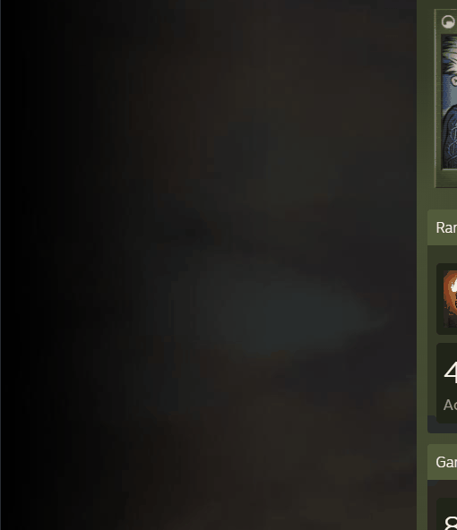
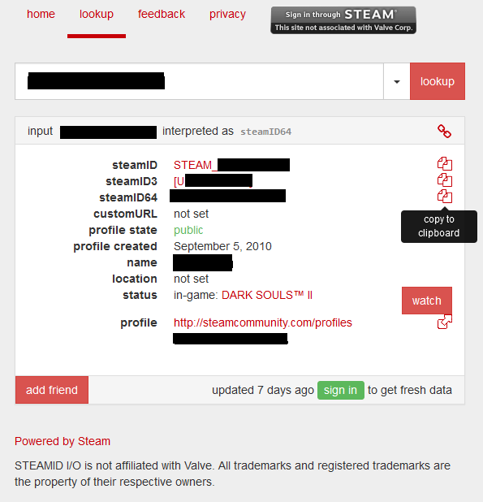

1. Copy your steam profile link. 

If you don’t have it available just right click anywhere on your Steam background and click **Copy Page URL**.

2. Head over to https://steamid.io/ . 

3. Once there you can paste the URL you have copied from your steam profile and press **lookup** and then copy the steamID you need.

