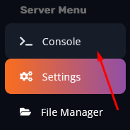
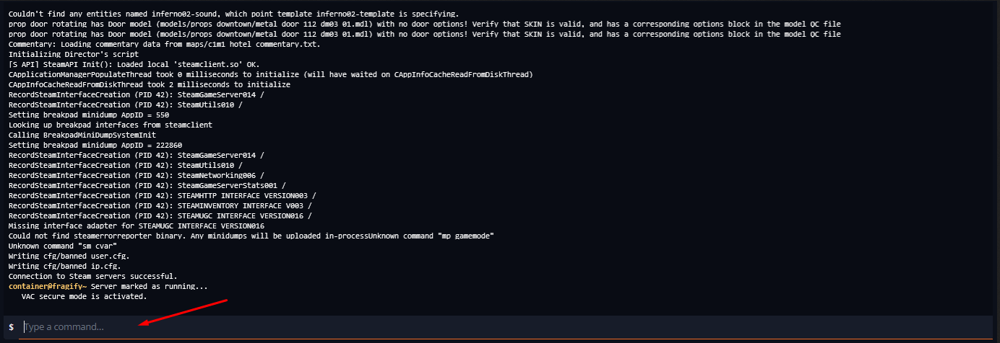

Kicking players from your server is simple.

1. Go to your Fragify panel. The console tab should be open by default. If not, click on the console tab. 

2. Once the console is open, click on the field with **Type a command…** written on it.  

3.  Type in `kick playername`, and that should kick the player you have chosen.