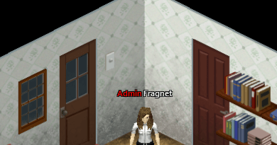

There are 2 ways to make a player an admin which we will explain in this article.

# #1 Server Console

You can find your server's console on the main page after selecting your server on the Fragify panel.

1. Login to the [Fragify panel](https://panel.fragify.net/auth/login) and select your Project Zomboid server.

2. You can see the input field with **Type a command...** under your server's console.


3. Join your server and return to the Fragify panel. Type the following command:
```
setaccesslevel usernameOfPlayer admin
```


You will see as a confirmation the following text in the console:

Afterwards, you will see next to your username **Admin** tag marked in red colour.


There are also different access levels apart from **Admin**. 
The list of all access levels and their abilities:

**Observer**
* Toggle god mod (on himself only)
* Toggle invisible (on himself only)
* See players connected (/players)
* Teleport to a player (can't teleport a player elsewhere)
*  Can toggle noclip (on himself only)
* Teleport to coordinates
*  See server options
*  Can open locked doors
*  Can go inside safehouses
*  Can't be kicked if too laggy
*  Can always join server (even if full)
*  Can talk even being invisible
*  Sees invisible players
*  Can't be hit by players
*  Log directly invisible/invincible
*  Can see players stats (name, skill, traits...) with click on player -> Check Stats (but can't modify them)

**GM**
*  Everything an Observer can use, plus:
*  Toggle god mod (on himself and others)
*  Toggle invisible (on himself and others)
*  Can toggle noclip (on himself and others)
*  Teleport to a player to another player  
*  Use /alarm, /gunshot, /thunder and /chopper
*  Start/Stop rain
*  Add item
*  Add xp

**Overseer**
*  Everything a GM can use, plus:
*  Create horde
*  Kick user
*  Display server message
*  See connection info of a player
*  Disconnect a player by connection number (/disconnect)
*  Use /nightlengthmodifier
*  Can modify player stats in the player stats UI
*  Can ban a player from /all chat

**Moderator**
* Everything an Overseer can use, plus:
*  Ban/Unban user (including steam ID)
*  Manipulate whitelist (/adduser, /addusertowhitelist, /addalltowhitelist, /removeuserfromwhitelist
*  Change access level (can't set admin)
*  Can setup safehouses

**Admin**
*  Everything a Moderator can use, plus:
*  Save world
*  Quit world
*  Change access level (including admin)
*  Reload server options
*  Change server options
*  Send pulse
*  Reload Lua files
*  Bypass Lua checksum

If you want to see any other available commands in console, you can type `help`.

# #2 Editing PZServer.db file
To add an admin to your Project Zomboid server, you will need to edit the serverPZ.db.  
  
The server will look in your zomboid database folder (`/pzserver/db`) for a database file (**PZServer.db**) with username / passwords to authorize people trying to connect to your server.

1. Login to the [Fragify panel](https://panel.fragify.net/auth/login) and select your Project Zomboid server.

2. Stop your server and navigate to the **File Manager** option on the left-side menu.


3. Go to the following directory: `pzserver/db` and you will find **PZServer.db** file. You will need to click on **...** => **Download** option.


4. Next, download this: [SQLite Admin](http://sqliteadmin.orbmu2k.de/) It's for editing file based sql (sqlite) databases.

5. Go into **Tables**, click **whitelist**, expand it out and click a random field (say id).

6. Then click the **Edit Data** tab, and you can put data in. All you need to do is to tick the “Admin” checkbox next to the players that you want to have admin rights.  
Example:
 Close the database once you've made your changes, and it'll auto save.   

7. Upload the modified file onto the server to replace the existing one by clicking **Upload** button or using the drag and drop function.


8. Start the server, and the player should have admin privileges.