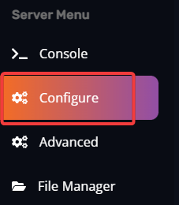
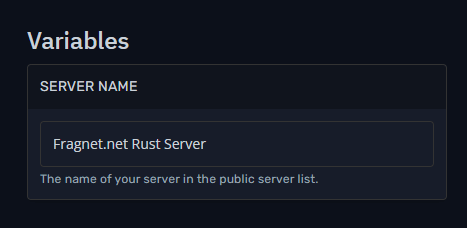
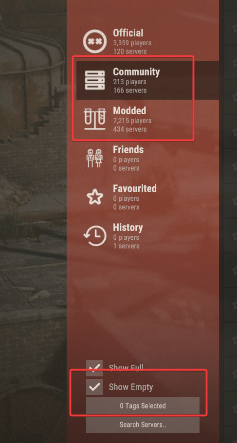
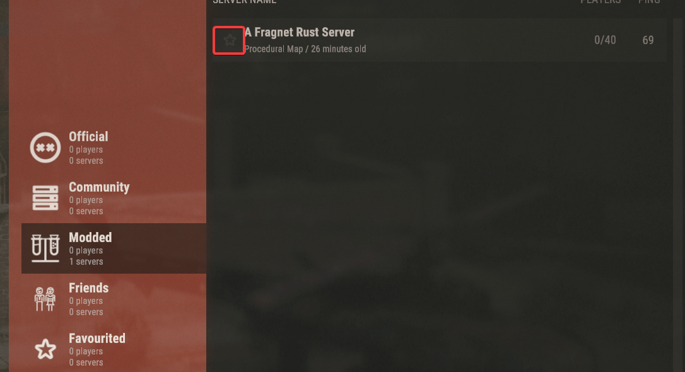
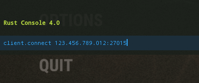
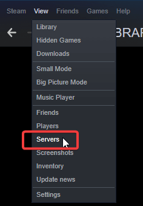
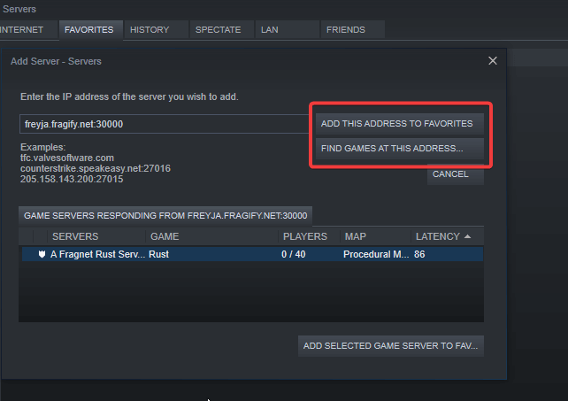

There are multiple methods to connect to your Rust server which we will describe here.

#  Via in-game server browser

1. Make sure to change server's name in **Configure** option on the left-side menu => **Server Name** variable.





2. Start your Rust server. After starting your Rust server on the Fragify panel, please, allow 5-10 minutes for the startup process to be completed. 

3. Open Rust game and go to **Play Game**. The server browser will appear and you will need to choose **Community** tab if you did not install **uMod/Oxide** extension. If you have installed **uMod/Oxide** and plugins, you will need to choose **Modded** tab. Note that you might need to tick the box next to **Show Empty** to find faster your server. Also, you can select tags to find your server. Tags can be added in **Configure** option => **Server Tags** variable. You can read more about them on the [official Facepunch wiki](https://wiki.facepunch.com/rust/server-browser-tags).



4. Type your server's name in **Search Servers..** field and wait till the server appears. Sometimes you will need to click on **Refresh** since the server can take some time to appear due to how the listing of servers works. 



We recommend clicking on the star sign next to your server, so that it can be always found in the **Favorites** tab. 

# Via in-game console command

1. Open your Rust game and once loaded on the main menu, click **F1** key. 

2. You will see a Rust console window and you can type the following command:
```
client.connect yourServerIP:Port
```
Example:
```
client.connect 123.456.789.012:27015
```


3. Click **Enter** key and you will be joining your server. If you want to close Rust console window, you can press **F1** key again. 

# Via Steam Favorites

1. Open your Steam client and navigate to **View** tab => **Servers** option.



2. Go to **Favorites** tab and click on **Add a server** button.

3. You can input your server's IP and port and click on **Add this address to favorites** and you will be able to access your server at anytime from **Favorites** tab. You can also click on **Find games at this address...** and you will see your server.

