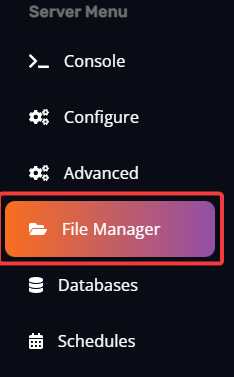

#Installing Rust:IO on your RUST server

Rust:IO is a Rust Oxide extension, which adds a fully interactive browser live map of your Rust world. This map allows you to see player locations, buildings, and more. 

!!! info "INFO"
	Server should be stopped before installing Rust:IO!

Adding Rust:IO to your server:

*   Go to your Rust server on the Fragify Game Panel.

*   Navigate to **File Manager** option on the left-side menu and go to `RustDedicated_Data/Managed` directory.

*   Make sure that **uMod/OxideMod** is installed, if not follow instructions from [here](install-oxide.md). It is important as it is a requirement for Rust:IO.

*   Download `Oxide.Ext.RustIO.dll` from http://playrust.io/latest .

*   Once downloaded, upload to `RustDedicated_Data/Managed` directory by clicking on **Upload** button or using the drag and drop function. 

* Simply start the server and this extension will load.

You have successfully installed Rust:IO to your server. You can now find your server on [playrust:io](http://playrust.io/) when you write your server name!

Need to edit the configuration settings for Rust:IO?
----------------------------------------------------

Rust will generate a configuration file for Rust:IO at this location: **/rust/Oxide/config/RustIO.json** which can be edited.