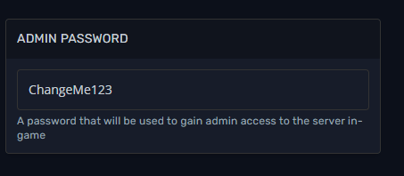

# Becoming an admin on your The Forest server

By becoming an admin on your Forest server, you will get access to features such as: kick or ban players, change certain values of cvars from in-game.

Setting up admin password
=========================

In order to become an admin, you will need to set an admin password on your server.  
  

*   Login to the [Fragify panel](https://panel.fragify.net/auth/login) and select your The Forest server.

*   Go to **Configure** option on the left-side menu and look for **Admin Password** variable.

*   Set it to the password that you would like to use.

Make sure to restart the server after the editing (if it was running while you were editing server.cfg) so the changes can take effect!

  
Logging in with admin password
==============================

Now when you've set the admin password, we need to log in with it to the server in order to gain access to mentioned features.  

*   Start your game.

*   Go to **Multiplayer** => **Join Game** => **Dedicated Servers (Internet)**.

*   Find your server and press **Join**.

*   Write the admin password and press **Join** once again.

Confirming that you are logged in as admin
==========================================

Once you are on the server, you can easily check if you've got access to admin features.

*   Type **/help** in the chat

If you get the following response. You are connected as administrator.  
