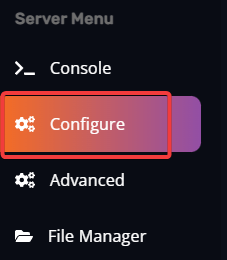

#Connecting to your The Forest Server

Connecting via Server Browser
=============================

> GSLT Token needs to be set in **Steam Account Token** variable which can be found by navigating to **Configure** option on the left-side menu. Create a token [here](https://steamcommunity.com/dev/managegameservers) with app ID: 242760.

Please, restart server for the change to be applied.

  
Once you add your GSLT token and restarted server, your server should be accessible via server browser. 

Simply follow these steps to connect to your server:

*   Launch your game via Steam.

*   Go to **Multiplayer** => **Join Game** => **Dedicated (Internet)** tab.

*   Press **Refresh**.

*   Find your server on the list or simply write the name of it in the "Filter by name" field.

Wait for the browser to query the server. Once it's queried, simply press **Join**.

> If you already have character on the server, you need to press **Continue** upon joining. If you press **Join** your character progress will be lost, and you will start from the beginning!

Connecting via Steam Favorites
=============================

1\. Open your Steam client and navigate to **View** tab => **Servers** option.

2\. Go to **Favorites** tab and click on **Add a server** button.

3\. You can input your server's IP and Query Port (can be found in **[Connection Port]** variable in **Configure** option) and click on **Add this address to favorites** and you will be able to access your server at anytime from **Favorites** tab. You can also click on **Find games at this address...** and you will see your server.