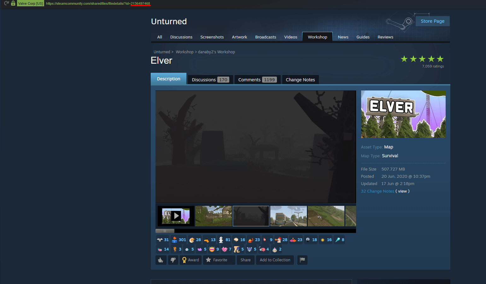

Adding mods to your server is fairly simple.

But first, let's ensure that you are subscribed to the mod of your choice.

1. Go to your Unturned Steam workshop page, find the mod you want and subscribe to it.

2. Once subscribed, copy the number from the link as stated in the screenshot. That is the mod ID that we need.

3. Navigate to your **File Manager** on the Fragify gamepanel. Go to `Servers => Default`, and you will find `WorkshopDownloadConfig.json`. It should look something like this:

4. You should make space for your mod IDs by pressing enter between the parenthesis at the **File_IDs** line. Paste your mod ID in between, click on save content and start your server.

The server should download the mod that you have installed the mod on your server. 
Once started, you will see this in the server console, which means the mod is downloaded, and the server automatically setup the files and folders for it.

You can add more mods by adding mod IDs under each one, but don’t forget to add a comma `,` between each mod like this:

