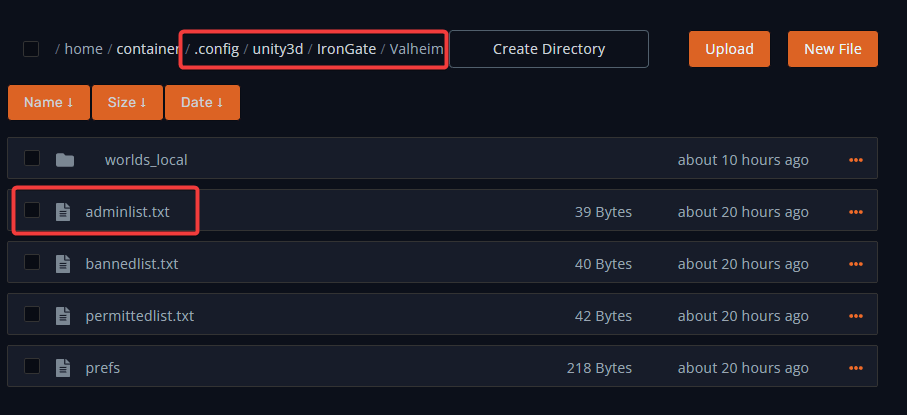
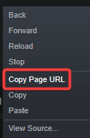
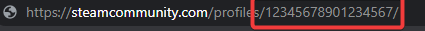
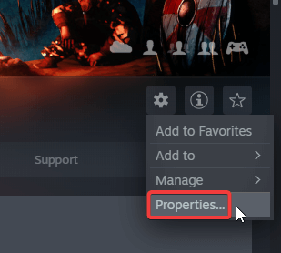
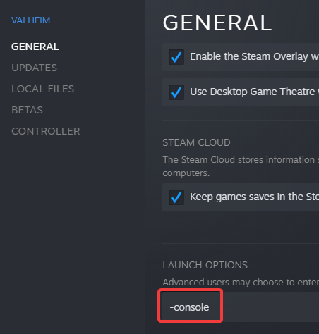

**This guide will help you understand how to become an administrator and use commands while on the server.**

# Adding an admin to adminlist.txt

1\.  Login to the [Fragify panel](https://panel.fragify.net/auth/login) and select your Valheim server.

2\. Go to **File Manager** and navigate to `.config/unity3d/IronGate/Valheim` directory. You will need to open the **adminlist.txt** file.

3\. You will need to input your **Steam64ID**. If you want to add several admins, you will need to paste each **Steam64ID** on the new line.

If you don't know how to find your Steam64ID, follow those steps:

* Go to your Steam app => Profile and right-click anywhere in the window. 
* Select the **Copy Page URL** option and paste your link on https://steamid.io/ 

Alternatively, you can find Steam64ID by going to the Steam website and logging in => Select your profile and look at the URL in the browser. Steam64ID is a unique identifier that is shown after `https://steamcommunity.com/profiles/`

4\. Click on **Save Content** button after adding Steam64ID in **adminlist.txt** file.

5\. Start/Restart the server for the change to be applied.

# Enable admin console

1\. Open your Steam client and go to **Library** tab = Settings button => **Properties...** option. 

2\.In the **General tab**, you will need to add the `-console` argument to your **Launch Options**.

3\. Start your Valheim game. 

# How to use the console

1.  Start your server and join it. 
    
2.  Once connected, press the \[F5\] key to open the console.
    
3. Type "_help_" for all available commands.