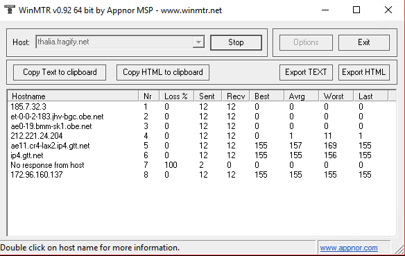

# How to perform a WinMTR
## Troubleshooting connection/latency issues

In order to troubleshoot any connection problems that you may experience with your server(s), our support team will often require information regarding how data travels from your computer to our network.  
While a traceroute can be used to understand where the issue may exist, WinMTR results provide all the required information with some extra troubleshooting points. Here is how to fetch such results:

  

**For an accurate diagnosis, it is necessary that you provide us with the WinMTR results instead of traceroute results!**

  
### Performing a WinMTR

1.  Download WinMTR from here: [https://sourceforge.net/projects/winmtr/files/WinMTR-v092.zip/download](https://sourceforge.net/projects/winmtr/files/WinMTR-v092.zip/download "https://sourceforge.net/projects/winmtr/files/WinMTR-v092.zip/download")
2.  On the input field, insert your server's IP address without the port at the end, afterwards hit the _"Start"_ button.
3.  Leave the scan running for a while (at least 10 minutes) then press the _"Copy Text to clipboard"_ button.
4.  Paste the results to [https://bin.fragnet.net](https://bin.fragnet.net) and provide us with the link to it on your  support ticket reply.

### Performing a traceroute if you are unable to perform a WinMTR

1.  On your Windows OS, click on the start menu and search for Command Prompt (or cmd)
2.  Open the Command Prompt
3.  In the Command Prompt window, type in tracert <YOUR SERVER IP> without the port at the end, and then hit enter.
4.  You will start getting data on your Command Prompt window.
5.  Once it's done, copy the data by right-clicking on the title bar and going to "Edit → Select all → and then "Edit → Copy" 
6.  Include the result along with your computer's IP address on your next support ticket reply.

You can check what's your IP on the following website: [http://www.whatismyip.com/](http://www.whatismyip.com/)